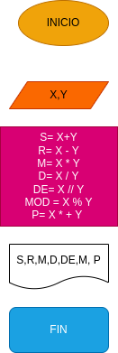

 # EJERCICIO 3
# Operaciones_aritmeticas 
Implementan un programa para calcular la suma ,la resta,multiplicacion,division divison entera,modulo y potencias de 2 numeros 

# ANALISIS

Variables de entrada(input)

X:primer numero

Y:segundo Numero

Variables de proceso y salida (processing,storage,autput)

S:suma de X y Y

R:resta de X y Y

M:multiplicacion de X y Y

D: division de X y Y 

DE: division entera de X y Y

MO: modulo de X y Y

P: petencias de X y Y 

# DISEÑO
 
  

 # COSTRUCCION 